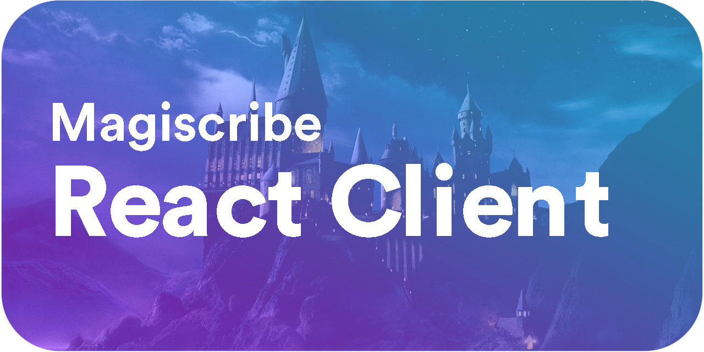

#  <!-- omit in toc -->


---

# Table of Contents <!-- omit in toc -->

- [Overview](#overview)
  - [Short Demos](#short-demos)
- [Zero to Hero](#zero-to-hero)
    - [Pre-requisites](#pre-requisites)
    - [General Setup](#general-setup)

# Overview

This repository contains a Node.js Vite application that serves as the dashboard for the project. The application is built using TypeScript and React.

## Short Demos

**Agent Lab:**
The following video demonstrates the GraphQL API in action. The API is used to query the database for agents, capabilities, and their related prompts. It allows easy creation of new agents, capabilities, and prompts as well as additional features like per-organization authorization through Clerk.

https://github.com/user-attachments/assets/1dac0771-db65-4cf1-ad5e-aa70c54a8c4e

**Inquiry Builder:**
The following video demonstrates the GraphQL API in action. The API is used to query the database for inquiry graphs. An inquiry graph is a dictated conversation flows that can be used to generate a conversation between an agent and a user. It allows for stakeholders to get a dynamic conversation flow between a user and an agent to probe for information or insights, while ensuring that the agent stays on tasks, asks the right questions in the right order, and does not miss any important information while still allowing the user and conversation to go off script at certain times depending on the graph.

https://github.com/user-attachments/assets/908ae6d8-e7e9-4fb1-8964-90411095353e

# Zero to Hero

### Pre-requisites

- [ ] [Node.js](https://nodejs.org/en) (version 20.x or later)
- [ ] [AWS CLI](https://aws.amazon.com/cli)
- [ ] [Terraform CDKTF](https://learn.hashicorp.com/tutorials/terraform/cdktf-install)
- [ ] [Docker](https://www.docker.com/get-started)

### General Setup

> The following steps are required to setup the project for local development and deployment.

1. Configure AWS CLI. You can do this with `aws configure`. If the environment you working with is managed by AWS SSO, you can run `aws configure sso`. For more on this see [AWS CLI Configuration](https://docs.aws.amazon.com/cli/latest/userguide/cli-configure-quickstart.html).

2. Enable `corepack` for `pnpm` to install the dependencies. You can do this by running the following command:

```bash
corepack enable pnpm
corepack use pnpm@latest
```

3. Download the repository

```bash
git clone git@github.com:Magiscribe/Dashboard.git
```

4. Change directory to the project root

```bash
cd Dashboard
```

5. Install the dependencies

```bash
pnpm install
```

6. Copy the `.env.example` file to `.env` and update the values accordingly.

```bash
cp .env.example .env
```

7. Run the development server

```bash
pnpm dev
```

8. Congratulations! You have successfully setup the project for local development.
